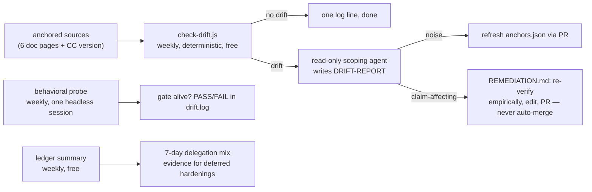

# claude-plugins

Claude Code plugins by [Bill Siegler](https://github.com/TheRealBillSiegler), served from the `siegler-plugins` marketplace. Currently one plugin: **delegation-steering** — explicit model/effort tiering for every delegated agent, enforced by a deterministic gate rather than trusted to prose, with the evals and drift detection that keep it true as Claude Code evolves.

## Install

```text
/plugin marketplace add TheRealBillSiegler/claude-plugins
/plugin install delegation-steering@siegler-plugins
```

Or directly in `~/.claude/settings.json`:

```json
"extraKnownMarketplaces": {
  "siegler-plugins": { "source": { "source": "github", "repo": "TheRealBillSiegler/claude-plugins" } }
},
"enabledPlugins": { "delegation-steering@siegler-plugins": true }
```

Restart your session, then run `/delegation-steering:canary` — it verifies the gate end-to-end and installs the always-loaded rule file.

**Requirements:** Node.js on `PATH`; on Windows, Git for Windows (hooks declare `"shell": "bash"`).

## What you get

The two skills are consultation surfaces — `delegation-tiering` fires when Claude spawns or configures agents; ask `steering-claude-code` "where should this behavior live?" — and the hooks enforce and observe without being asked:

| Component                    | What it does                                                                       |
| ---------------------------- | ---------------------------------------------------------------------------------- |
| `delegation-tiering` skill   | Assigns each delegated agent the lowest sufficient model/effort tier               |
| `steering-claude-code` skill | Decision tree: CLAUDE.md vs rules vs skills vs subagents vs hooks vs output styles |
| `agent-model-gate` hook      | PreToolUse gate: denies model-less Agent calls, lints Workflow scripts at launch   |
| `delegation-ledger` hook     | Appends one JSONL line per delegation for tier-quality review                      |
| `canary` command             | Live end-to-end verification of the gate, plus rule-file install                   |

Full component docs: [plugins/delegation-steering/](plugins/delegation-steering/). The measurement apparatus — contract tests and fixtures, scenario evals, coverage matrix, drift detection, methods records — lives at repo level ([evals/](evals/), [docs/](docs/), [scripts/](scripts/)) and is deliberately **not** part of the installed plugin.

## Why trust it

Every claim is verified or explicitly marked pending: the gate is live-tested on all branches (deny, allow, launch-lint, nested spawns), the contract suite runs 10/10, both skills carry dated baselines (12/12 and 7/7 at the weakest served tiers — smoke-test grade until the mechanized re-baseline, per the [eval methodology](evals/README.md)), and the drift pipeline caught a real claim-affecting upstream doc change in its first week. What is *not* yet proven is tracked in the open — whether each component is *necessary* is a registered open question, and the published base rate for steering artifacts leans "no effect" ([research record](docs/research/prior-art-and-eval-methodology-2026-08-09.md)); the measurement program exists to find out, stamping load-bearing / ceremony / harmful verdicts per component. This repo is deliberately two things: a small plugin, and a working demonstration of evidence-first plugin maintenance — drift-watched claims, methods records, pre-registered necessity studies. Receipts: [coverage matrix](docs/COVERAGE.md) · [methods records](docs/METHODS.md) · [eval methodology](evals/README.md) · [measurement map](https://github.com/TheRealBillSiegler/claude-plugins/issues/2)

## How it stays fresh

Claude Code ships fast; these plugins anchor their claims instead of assuming them — dated quote digests for article-only claims, specific doc pages for mechanics (docs win over articles), dated live tests for enforcement boundaries. A weekly scheduled task runs the loop:



Drift triage and edit rules: [REMEDIATION.md](docs/REMEDIATION.md)

## Development

- Branch → PR into `main`; no direct pushes. Conventional commits.
- Contract tests: `node evals/contract/run-contract-tests.js`
- Any change to hook lint semantics must keep `node plugins/delegation-steering/hooks/agent-model-gate.js --test` passing and add a case for the failure class it fixes.
- Multi-agent runs that produce conclusions must record their methodology in [METHODS.md](docs/METHODS.md).

[MIT licensed](LICENSE).
