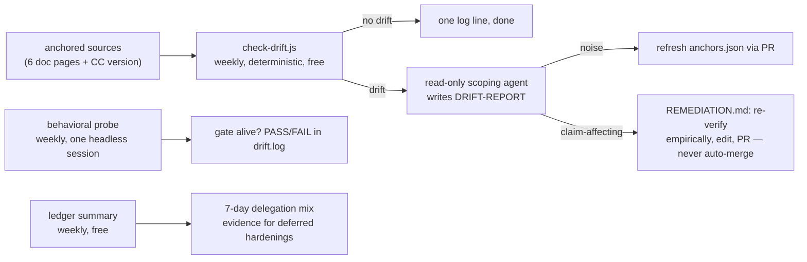

# claude-plugins

A Claude Code plugin marketplace (`siegler-plugins`) by [Bill Siegler](https://github.com/TheRealBillSiegler). Plugins here turn engineering discipline into enforceable configuration: probabilistic guidance (skills, rules) backed by deterministic gates (hooks), with evals and doc-drift detection so Claude Code's release cadence can't silently rot the claims they rest on.

## Plugins

### [delegation-steering](plugins/delegation-steering/)

Explicit model/effort tiering for every delegated agent, enforced — plus a decision guide for where Claude Code behavior should live.

| Component                    | What it does                                                                       |
| ---------------------------- | ---------------------------------------------------------------------------------- |
| `delegation-tiering` skill   | Assigns each delegated agent the lowest sufficient model/effort tier               |
| `steering-claude-code` skill | Decision tree: CLAUDE.md vs rules vs skills vs subagents vs hooks vs output styles |
| `agent-model-gate` hook      | PreToolUse gate: denies model-less Agent calls, lints Workflow scripts at launch   |
| `delegation-ledger` hook     | Appends one JSONL line per delegation for tier-quality review                      |
| `canary` command             | Live end-to-end verification of the gate, plus legacy cutover cleanup              |
| `evals/`                     | Offline hook contract tests and skill application scenarios with baselines         |
| `scripts/check-drift.js`     | Deterministic doc/version drift detection against dated anchors                    |
| `docs/REMEDIATION.md`        | The drift procedure: scope the diff, re-verify empirically, ship via PR            |

## Install

In Claude Code:

```text
/plugin marketplace add TheRealBillSiegler/claude-plugins
/plugin install delegation-steering@siegler-plugins
```

Or directly in `~/.claude/settings.json`:

```json
"extraKnownMarketplaces": {
  "siegler-plugins": { "source": { "source": "github", "repo": "TheRealBillSiegler/claude-plugins" } }
},
"enabledPlugins": { "delegation-steering@siegler-plugins": true }
```

Then restart your session and run `/delegation-steering:canary` — it verifies the gate end-to-end (deny, allow, and lint branches), installs the always-loaded rule file, and cleans up any pre-plugin loose-file install if you had one.

**Requirements:** Node.js on `PATH` (the hook and scripts run via `node`); on Windows, Git for Windows (hooks declare `"shell": "bash"`).

## Using the skills

- `delegation-tiering` triggers when Claude spawns or configures subagents and workflow fan-outs — it assigns each delegated agent the lowest sufficient model tier, and the hook makes the "explicit model, always" rule non-optional.
- `steering-claude-code` is a consultation skill: ask Claude "where should this behavior/constraint live?" (CLAUDE.md vs rules vs skills vs subagents vs hooks vs output styles) and it applies the decision tree. It also fires when Claude authors or refactors that configuration on your behalf. Its value shows up at configuration time, not during ordinary coding.

## Freshness pipeline

Claude Code updates frequently; these plugins anchor their claims instead of assuming them:

1. **Anchored sources** — every skill claim carries its fidelity tier: article-only claims pin to dated quote digests in `references/`; mechanics cite specific [code.claude.com/docs](https://code.claude.com/docs) pages (docs win over articles); enforcement-boundary behavior is verified empirically with dated live tests.
2. **Deterministic detection + weekly probe** — `scripts/check-drift.js` hashes the anchored doc pages and records the Claude Code version against `scripts/anchors.json`. The `weekly-drift-task.ps1` Task Scheduler wrapper runs it weekly, fires one tiny headless session probing that the gate still denies model-less delegation, and appends a 7-day delegation-mix summary from the ledger; the metered scoping agent runs only on confirmed drift.
3. **Agentic remediation** — on drift, [REMEDIATION.md](plugins/delegation-steering/docs/REMEDIATION.md): scope the diff (exit early on noise), re-verify empirically (contract tests + live canary), edit at the right layer, ship via PR. Never auto-merged.
4. **Evals** — `evals/contract/` (offline hook contract), `/delegation-steering:canary` (live end-to-end), `evals/scenarios/` (skill application scenarios with recorded baselines).



## Development

- Branch → PR into `main`; no direct pushes. Conventional commits.
- Contract tests: `node plugins/delegation-steering/evals/contract/run-contract-tests.js`
- Any change to hook lint semantics must keep `node plugins/delegation-steering/hooks/agent-model-gate.js --test` passing and add a case for the failure class it fixes.
- Refresh the drift baseline (`check-drift.js --update`) only as part of a reviewed PR.
