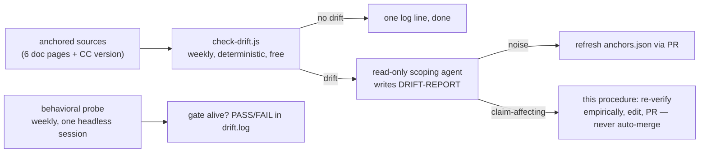
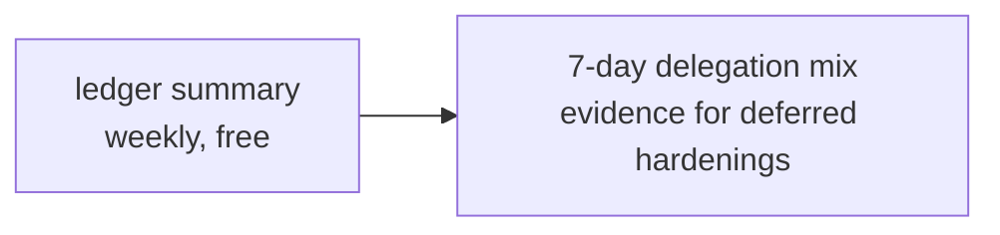

# Drift remediation procedure

Follow this when `scripts/check-drift.js` exits 1 (doc-page or Claude Code version drift), or when `/delegation-steering:canary` fails after a Claude Code update. Detection is deterministic; everything below is judgment — run it as an agent session in the plugin repo, and land changes via PR, never by committing directly to `main`. Auto-merging changes to live enforcement config is prohibited: a misread doc diff must not be able to rewrite the guardrails unreviewed.

## Detection

Two weekly automated checks can land you here — `check-drift.js` is deterministic and free; the behavioral probe spends one headless session:

- **check-drift.js**: diffs the 6 anchored doc pages plus the Claude Code version against `anchors.json`. No drift → one log line. Drift → a read-only scoping agent writes a DRIFT-REPORT, then this procedure branches on whether the drift is noise (refresh `anchors.json` via PR, stop) or claim-affecting (continue below).
- **Behavioral probe**: one headless session, weekly, runs the gate live and logs PASS/FAIL to `drift.log`. A FAIL is the other trigger for this procedure — it's what a `/delegation-steering:canary` failure after a Claude Code update looks like when caught automatically instead of by hand.

## Anchoring policy

Which anchor a claim needs — dated quote digest, doc page, or dated live test — is defined once in the plugin README's [Source fidelity tiers](../plugins/delegation-steering/README.md#source-fidelity-tiers). Step 2 below re-verifies against whichever tier the drifted claim belongs to.

## Procedure

1. **Scope the drift first — exit early if it's noise.** For each page check-drift reports as changed, fetch it and diff against the claims the skills actually anchor to it (each SKILL.md's "Doc anchors" bullet names the page-to-claim mapping). Typo/format/unrelated-section changes → run `node scripts/check-drift.js --update`, commit the refreshed `anchors.json` with a one-line note, and stop. Do not touch skill prose for noise.

2. **If an anchored claim is affected**, re-verify the mechanic empirically before editing prose:
   - Run `node evals/contract/run-contract-tests.js` (offline contract).
   - Run `/delegation-steering:canary` in a live session (Agent deny, Workflow launch-lint deny).
   - If a canary fails, diagnose against the changed doc page: renamed tool (matcher dead), changed hook JSON contract, changed Workflow tool_input shape are the known failure classes.

3. **Edit at the right layer.** Hook behavior changes go in `hooks/agent-model-gate.js` (keep `--test` passing; extend it if the fix changes lint semantics). Claim changes go in the affected SKILL.md section AND its dated reference digest if the source moved. Update "Last verified" dates only for claims actually re-verified — including the affected cells of [COVERAGE.md](COVERAGE.md), which must change in the same PR as any fix that changes what a cell claims.

4. **Re-run everything**: contract tests, `--test`, canary, and the scenario evals (`evals/scenarios/*.md`) if skill prose changed.

5. **Ship**: branch → conventional commits → PR with a body stating which doc pages drifted, which claims were affected, and the verification evidence. Bump the plugin version in `.claude-plugin/plugin.json` (SemVer: message/prose = patch; lint semantics or new enforcement = minor). Include `node scripts/check-drift.js --update` output so `anchors.json` lands in the same PR.

6. **After merge**: update the installed plugin (marketplace pull), restart the session, run `/delegation-steering:canary` once more against the installed copy.

## Known blindness: drift detection is preservation-only

The drift check answers "did what we rely on change?" — it cannot answer "did something new appear that we should use?" A new Claude Code capability fires nothing unless it happens to alter an anchored claim (the 2026-08-06 catch — a new `effort` field documented in agent-definition frontmatter — was that lucky case), and features landing on unwatched pages or in release notes are fully invisible. Opportunity detection is a separate, judgment-based review: periodically (monthly is proportionate) read the Claude Code changelog/release notes with the question "does anything new bear on delegation, spawn surfaces, hook events, or effort control?" — as a deliberate session, not an always-on agent. Findings route through the normal PR path.

## Deferred hardenings

- **Scoped rationale gate** — deny top-tier Agent calls (`fable`, or `opus` when it is the session's top tier) whose input carries no rationale marker.
  - **Why deferred:** deliberately not built — rationale strings demanded on every call degrade into gate-passing boilerplate.
  - **Trigger to build:** the weekly ledger summary shows top-tier over-provisioning actually happening (e.g. a sustained top-tier share on mechanical-sounding delegations).
  - **Scope:** top-tier calls only.

The ledger summary is what would surface the over-provisioning pattern that triggers the scoped rationale gate above.

## Failure classes seen so far

| Date | Failure | Fix | Lesson |
| --- | --- | --- | --- |
| 2026-08-05 | Lint span-boundary desync — `agent (` written with a space threw off the lint's call-span detection, so a neighboring call with no `model` went unchecked | Caught by review; now guarded by `--test` | Any lint change needs a masking-direction test case |
