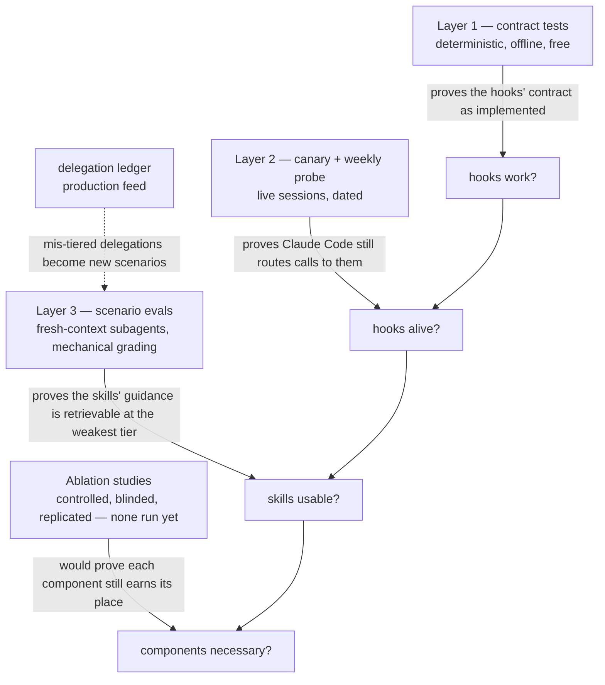

# Eval methodology

What the evals verify, where each layer's cases come from, and how the set grows. The layers are ordered by what they can prove: deterministic contract → live behavior → skill application quality.

Directory map — one directory per plugin, so what ships and what tests it are named alike: [delegation-tiering/](delegation-tiering/) — contract tests and fixtures (layer 1; own README), tier-assignment scenarios (layer 3), and the routing-impact study protocol for the tier-policy outcome study, written for pre-registration but still a draft: not yet registered, by its own status line; [steering-claude-code/](steering-claude-code/) — application scenarios for the steering skill (layer 3).

The four evaluation layers chain from proving the hooks' contract as implemented, through proving Claude Code still routes calls to them, to proving the skills' guidance is retrievable, up to proving each component is still necessary, with mis-tiered delegations from the production ledger feeding new Layer 3 scenarios along the way.

## Layer 1: contract tests (`delegation-tiering/contract/`)

**Based on:** observed hook behavior and found bugs — one fixture per exercised branch, plus a regression fixture for every fixed bug. `wf-masking.json` is the archetype: it encodes the 2026-08-05 span-boundary bug — the first row of [the failure-class ledger](../docs/REMEDIATION.md#failure-classes-seen-so-far), which owns the description — and the same case is embedded in the hook as `node hooks/agent-model-gate.js --test`.

**Protocol:** `node evals/delegation-tiering/contract/run-contract-tests.js` — pipes each fixture to the hook, asserts decision and message substrings. Pure, offline, free. Verifies the hook's contract *as implemented*, not whether Claude Code still routes calls to it.

**Growth rule:** stated once in [the contract README](delegation-tiering/contract/README.md#growth-rule) — no fix without its regression case.

## Layer 2: live verification (canary + weekly probe)

**Based on:** the enforcement-boundary claims — what actually fires for what. These are largely undocumented (per-claim doc status is in [../docs/COVERAGE.md](../docs/COVERAGE.md)'s dependency table), were established by dated live tests (see the skill's Enforcement section), and can silently change on any Claude Code update — so they are re-established empirically, never assumed.

**Protocol:** `/delegation-tiering:canary` in a live session (both gate paths must deny; also performs the rule-file install). The weekly probe in `../scripts/weekly-drift-task.ps1` automates the same two assertions headlessly and logs PASS/FAIL to `drift.log`.

## Layer 3: scenario evals (`*/scenarios.md`)

**Based on:**

- `steering-claude-code/scenarios.md` — six scenarios converted from the source article's own when-to-use examples and anti-patterns (Zod rule, never-push-to-main, release checklist, personal preferences, noisy dependency audit, monorepo orientation), plus one probing the skill's building-enforcement guidance (workflow-spawn enforcement), which exists in no article.
- `delegation-tiering/scenarios.md` — one probe per ladder rung or durable rule in the skill's own contract, including the rule that "top tier" means the most capable model in the current session rather than a fixed name, and the rule that a model is written explicitly even when it matches the session default.

**Protocol:** fresh-context subagent given ONLY the skill file ("Read the skill and answer from it alone"), run at the weakest tier the skill should serve *before* stronger ones. Baselines are recorded in each scenario file with dates and **full model IDs captured at run time, never aliases** — an alias ("sonnet") goes ambiguous the moment a new generation ships, which is exactly when a stamp needs to say what it was measured on. Grading rule: if a model at or below sonnet misses a scenario, the skill's guidance is insufficient — fix the skill, not the model.

**Grading is mechanical, not judged:** the subagent returns a structured verdict per scenario (one canonical tier token plus effort band, as JSON), and pass/fail is computed by code — exact comparison against a checked-in answer key derived from each scenario table's Expected column. No LLM sits in the grading loop, so the judge-bias caveat class (unblinded comparison, paraphrase tolerance, author grading own skill) exits the design. Minimum 3 replicates per tier for a variance estimate. The 2026-08-05/06 baselines predate this rule — unblinded LLM comparison, single rep, graded by the same session that orchestrated the eval rather than an independent rater — and stand as smoke-test evidence only until the first mechanized re-baseline, which lands the answer key and comparator alongside the baseline it stamps. Scheduled: after the plugin cutover (canary), so the re-baseline measures the shipped artifact.

**Growth rule — toward production-drawn evals:** the source article's counsel is that real evals are "drawn from production." The delegation ledger is the production feed: when a weekly mix summary or manual review surfaces a mis-tiered delegation, convert it into a scenario with the correct expected tier. Author-derived scenarios (the current set) are the floor, not the end state.

## Necessity (ablation) status

Everything above proves the components *work*; ablation asks whether each still *earns its place* — remove it, observe matched behavior, stamp the verdict.

**Ablation protocol** — a controlled, blinded, replicated ablation study; the evidence bar for every verdict, defined here so it is self-contained: run matched arms for the component under test — control (component present) vs ablated (component absent) — in isolated per-arm configuration (prepared config directories; see [the arm-isolation research record](../docs/research/arm-isolation-2026-08-09.md)), at least 3 replicates per arm on realistic probe tasks, outputs graded blind to arm identity, tallied mechanically. Verdict: **load-bearing** (behavior degrades without it), **ceremony** (no observable difference), or **harmful** (better without it) — stamped with full model ID, date, and probe/replicate counts. Stamps expire on model upgrade.

**Method precedents:** the design instantiates the published controlled-ablation methodology for agent steering artifacts — matched-arm context-file ablation with mechanical grading ([arXiv:2607.27250](https://arxiv.org/abs/2607.27250)) and paired with/without-skill evaluation over deterministic verifiers ([arXiv:2603.15401](https://arxiv.org/abs/2603.15401)), whose base rate (39 of 49 public skills: no effect; 3: harmful) sets the prior for these verdicts. Blind, mechanical grading is required because LLM judges carry documented position, verbosity, and self-preference biases ([arXiv:2306.05685](https://arxiv.org/abs/2306.05685)) and rankings reversible by answer order alone ([arXiv:2305.17926](https://arxiv.org/abs/2305.17926)). Both precedent studies ran on pre-Claude-5 models — they justify the *method* here; their *results* are priors, not conclusions, for current models.

**Verdict bounds** (ported 2026-08-09 from the stated limits of the ablation harness that will run these studies):

- A fourth verdict, **UNRESOLVED**, exists for runs whose floors (replicates, worker-failure limits) were violated — it is never rounded into the other three.
- Verdicts at this scale are screening signals, not population claims; **ceremony** means "no delta detected at this n" and never authorizes deleting a component with a violation history — raise replicates and re-run instead.
- No component verdict is valid until the harness records a positive control (a known load-bearing component recovered as load-bearing) and a placebo (an irrelevant component returning ceremony) — the calibration ticket ([#13](https://github.com/TheRealBillSiegler/claude-plugins/issues/13)) blocks verdicts for exactly this reason.
- Blinding is label-level only: grading criteria must be phrased as observable outcome properties, never paraphrases of the component's wording (paraphrase leakage un-blinds through content); prefer a grader from a different model family or tier than the workers, and hand spot-check one probe's outputs before any ceremony verdict authorizes deletion.

Current status, stamped claude-fable-5 / 2026-08-06 (static-read assertions — no probe-arm evidence yet — except where noted):

| Component | Verdict | Evidence | Next step |
| --- | --- | --- | --- |
| Gate (deny branches) | load-bearing | violation history: 2026-08-01, three model-less calls silently inherited the top tier, pre-gate; denial counting added 2026-08-06 | count real denials (`denied: true` ledger lines; weekly summary reports them) |
| Allow-branch reminder | ceremony-candidate | none either way — rule + skill may already suffice | probe arms: matched delegations with/without the reminder |
| Rule file (floor) | untested, confounded | clean sessions can't be attributed between rule, skill, and reminder | ablate alone, not as a cluster |
| Skill bodies | capability-verified, necessity untested | the scenario baselines ([delegation-tiering/scenarios.md](delegation-tiering/scenarios.md), [steering-claude-code/scenarios.md](steering-claude-code/scenarios.md)) prove guidance is retrievable, not that tier choices differ without it | judgment probes with/without skill access |
| Tier policy (lowest-sufficient) | article-claimed, locally unmeasured | no local outcome comparison exists | outcome ablation: same real task at prescribed vs top tier, blind-graded; the ledger accumulates candidate tasks |
| Drift pipeline | one real catch (n=1) | 2026-08-06: claim-affecting doc change caught in week one | track catch/noise ratio across runs |

Harm surveillance (the third verdict): denial rate (friction on legitimate work), `model-gate:allow` marker frequency (lint false positives), redos after cheap delegations (ledger review). Cadence: re-run verdicts after each model upgrade — a verdict stamped on one model says nothing about the next.

## What the evals cannot show

Tier *optimality*. The layers prove models are explicit (gate), the gate is alive (probe), and the skills' guidance is retrievable and applicable (scenarios). Whether a specific real-world delegation used the cheapest sufficient tier is a judgment call — the ledger makes those calls reviewable, and [ROADMAP.md](../docs/ROADMAP.md) states what evidence would justify enforcing more.
