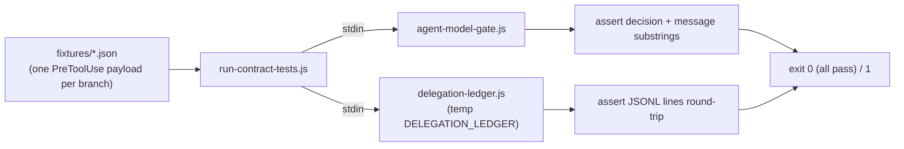

# Contract tests (`evals/contract/`)

Offline, deterministic verification of the two shipped hooks' input/output contracts — the strongest evidence layer in this repo because it requires no trust and no model: run it and read the exit code. It verifies the hooks *as implemented*, not whether Claude Code still routes calls to them (that is the `/delegation-tiering:canary` command's job).

In text: run-contract-tests.js pipes each fixture into both agent-model-gate.js, whose decision and message substrings it asserts, and delegation-ledger.js, whose JSONL round-trip it asserts against a temp ledger, then exits 0 only if every assertion passes.

## Files

- **`run-contract-tests.js`** — the runner. Pipes each fixture into the gate hook and asserts the permission decision and message substrings; also exercises branches no static fixture can hold (a real temp file for `scriptPath` lint, a missing path for the silent-allow branch, a temp ledger for denial counting) and finishes with the hook's own `--test` self-check. Run from the repo root: `node evals/contract/run-contract-tests.js`.
- **`fixtures/`** — one JSON PreToolUse payload per exercised branch. Each file carries a `_purpose` field (ignored by the hooks) stating which branch it pins and why it exists.

## The cases

| Case | Verifies |
| --- | --- |
| `agent-no-model.json` | Deny branch: Agent call without `model` is denied with re-issue instructions |
| `agent-with-model.json` | Allow branch: explicit model passes; reminder stays concise (no tier table) |
| `wf-masking.json` | Regression for the 2026-08-05 span-boundary bug: space-styled `agent (` must not hide a model-less neighbor |
| `wf-clean.json` | Workflow lint allow branch: all `agent()` calls carry models |
| `wf-predefined.json` | Fail-open branch: predefined workflow name, no script text to lint |
| scriptPath lint (deny) | Lint reads the script file from disk and denies a model-less call |
| scriptPath unreadable | Documented fail-open: unreadable path produces silence, not a crash |
| ledger round-trip | One JSONL line per delegation; Agent `model` and Workflow `modelLiterals[]` captured |
| escape-hatch scope | `model-gate:allow` suppresses only the call whose span it sits in — a marker in a file header does not |
| unknown tool | A tool the gate has no rule for passes through untouched, so widening the matcher cannot hard-block it |
| denial logging | Every deny appends a counted `denied: true` ledger line; the expected count is tallied as denials happen, not hardcoded |
| `--test` self-check | The span-boundary regression embedded in the hook itself still passes |

## Growth rule

Any change to lint semantics must keep `--test` passing and add a fixture (with `_purpose`) for the failure class it fixes — no fix without its regression case. Provenance and the full eval-layer methodology: [../README.md](../README.md).
