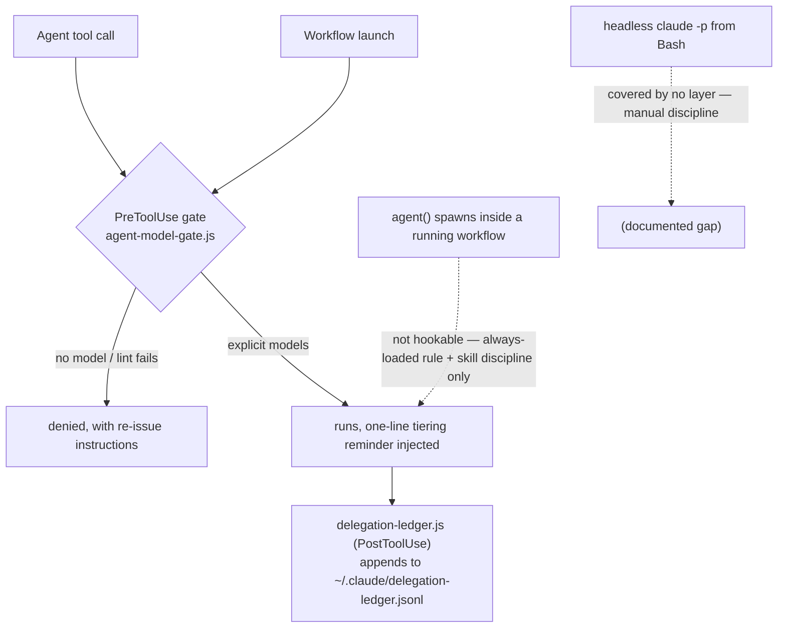

# delegation-steering

Explicit model/effort tiering for every delegated agent, enforced — plus a decision guide for where Claude Code behavior should live. Built from two Anthropic articles and the official docs, adapted for supervised delegation, and kept fresh by evals + drift detection.

## Components

- **`skills/delegation-tiering/`** — the tier ladder and selection questions for delegated agents (Agent tool, Workflow `agent()`, multi-agent plans). Loads on invocation.
- **`skills/steering-claude-code/`** — decision tree for CLAUDE.md vs rules vs skills vs subagents vs hooks vs output styles vs system-prompt appends, with locally verified addenda the article doesn't cover.
- **`hooks/agent-model-gate.js`** — PreToolUse gate (matcher `Agent|Workflow`): denies Agent calls without `model`; lints Workflow script text at launch and denies model-less `agent()` calls. `--test` self-check guards the lint's span-boundary logic.
- **`hooks/delegation-ledger.js`** — PostToolUse observability: appends one JSONL line per delegation to `~/.claude/delegation-ledger.jsonl` (model, agent type, description; per-workflow model lists) so tier choices are reviewable, not just explicit.
- **`commands/canary.md`** — `/delegation-steering:canary`: end-to-end live verification, rule-file install, and legacy cutover cleanup.
- **`evals/`** — offline hook contract tests (fixtures + runner) and application scenarios for both skills with recorded baselines; provenance and growth rules in [evals/README.md](evals/README.md).
- **`scripts/check-drift.js`** — deterministic doc/version drift detection against `anchors.json`.
- **`scripts/weekly-drift-task.ps1`** — Task Scheduler wrapper: drift check, weekly behavioral probe (one headless session asserting both gate paths deny), and a 7-day delegation-mix summary from the ledger.
- **`docs/COVERAGE.md`** — the enforcement coverage matrix: every delegation path × every layer, with per-cell verification dates. The canonical claim set of what is enforced where.
- **`docs/RUNS.md`** — the run register: methodology records (shape, tiers, adjudication, counts, limitations) for every multi-agent run whose conclusions landed in this repo. No record, no legitimacy.
- **`docs/REMEDIATION.md`** — the drift procedure, plus deferred hardenings and their evidence triggers.

## Three-layer enforcement

1. **Always-loaded rule** (`~/.claude/rules/delegation.md`, installed by the canary command): the standing rule survives compaction and holds without skill invocation. Probabilistic floor.
2. **Skill** (on invocation): the judgment layer — which tier is lowest-sufficient.
3. **Hook** (every Agent/Workflow call): the deterministic gate. Known limits are documented in the skill's Enforcement section: the workflow lint is a string heuristic (`/* model-gate:allow */` suppresses false positives), predefined workflows and unreadable scriptPaths fail open with a reminder, and headless `claude -p` delegation is covered by no layer.

The ledger sits alongside as the observability layer: the gate can force models to be *explicit*, but only review of actual choices can show whether tiering judgment held. Its weekly summary is the evidence base for the deferred rationale-gate hardening (see REMEDIATION.md).

### Coverage map



## Verify

```bash
node hooks/agent-model-gate.js --test              # lint self-check
node evals/contract/run-contract-tests.js           # offline contract (gate + ledger)
# then, in a live session with the plugin enabled:
/delegation-steering:canary                         # end-to-end + cutover
```

## Sunset criterion

This plugin is a stopgap for a missing platform feature, not a product to defend. If Claude Code ships native per-delegation model routing (demand is tracked upstream in anthropics/claude-code#27665, #44976, #67898), verify parity against [docs/COVERAGE.md](docs/COVERAGE.md) — every delegation path, deterministically enforced — and archive this plugin. The drift pipeline exists to notice that day, not to outlive it.

## Source fidelity tiers

- **Article-only claims** (advisor figure, start-smart posture): dated quote digests in each skill's `references/` — the blogs are the primary source; digests are the ceiling.
- **Mechanics**: specific `code.claude.com/docs` pages, listed per claim in each SKILL.md's Doc anchors; docs win over articles.
- **Enforcement-boundary behavior** (what actually fires for what): empirical, dated live tests — the docs are silent here; the canary and the weekly probe re-establish these after Claude Code updates.
