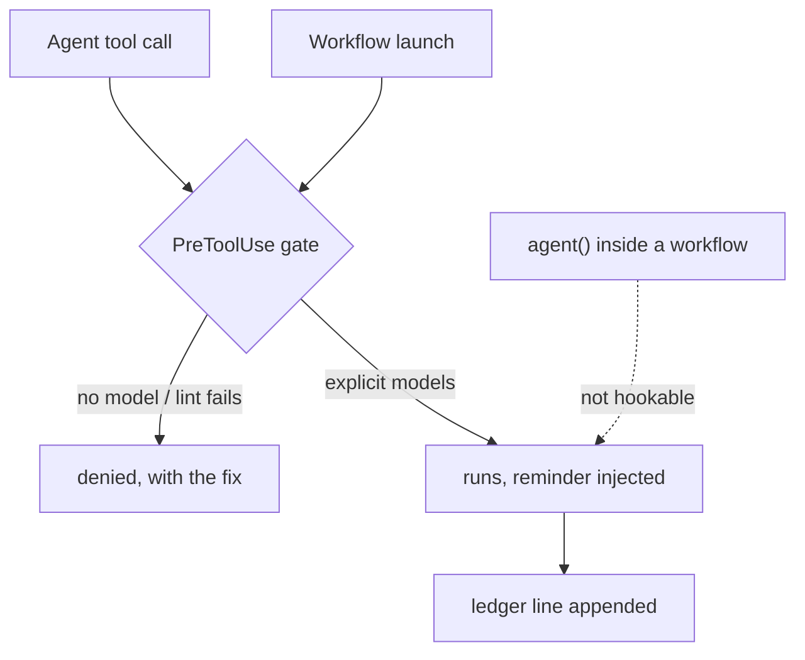

# delegation-steering

Explicit model/effort tiering for every delegated agent, enforced — plus a decision guide for where Claude Code behavior should live. Built from two Anthropic articles and the official docs, adapted for supervised delegation.

## Components

| Component | What it does | Fires when |
| --- | --- | --- |
| `skills/delegation-tiering/` | Tier ladder and selection questions for delegated agents (Agent tool, Workflow `agent()` calls, multi-agent plans). | Claude spawns or configures an agent |
| `skills/steering-claude-code/` | Decision tree for CLAUDE.md vs rules vs skills vs subagents vs hooks vs output styles vs system-prompt appends, with enforcement mechanics the article doesn't cover. | You ask where a behavior should live |
| `hooks/agent-model-gate.js` | Denies Agent calls without `model`; lints Workflow script text at launch and denies model-less `agent()` calls. | Every Agent/Workflow call (PreToolUse, matcher `Agent\|Workflow`) |
| `hooks/delegation-ledger.js` | Appends one JSONL line per delegation so tier choices are reviewable, not just explicit. | Every delegation (PostToolUse) |
| `commands/canary.md` | Live end-to-end verification of both gate paths, plus rule-file install. | You run `/delegation-steering:canary` |

Details:

- **delegation-tiering skill** loads on invocation — the judgment layer, not the always-loaded floor (see Three-layer enforcement below).
- **agent-model-gate** `--test` embeds the regression case for the lint's known failure class: an `agent (` call written with a space must not throw off call-span detection and hide a neighboring model-less call.
- **delegation-ledger** each line records model, agent type, description. A workflow call records `modelLiterals` — named for what it holds: the model strings scanned out of the script text. One entry per literal, not per agent, so a `model:` reused across a fan-out appears once and a non-agent occurrence still counts. Verified 2026-08-10 against three runs.

## Configuration

- **Ledger location** — `${CLAUDE_PLUGIN_DATA}/delegation-ledger.jsonl`, the [per-plugin data directory](https://code.claude.com/docs/en/plugins-reference) Claude Code provisions and exports to hook processes. Set `DELEGATION_LEDGER` to redirect it elsewhere.
- **Off switch:** `/plugin disable delegation-steering` deactivates the components ([plugins reference](https://code.claude.com/docs/en/plugins-reference)). Uninstalling removes the ledger along with the plugin's data directory — pass `--keep-data` to keep it. The rule file `~/.claude/rules/delegation.md` is left alone: it lives with your personal rules, not with the plugin.

## Three-layer enforcement

1. **Always-loaded rule** (`~/.claude/rules/delegation.md`, installed by the canary command): the standing rule survives compaction and holds without skill invocation — a probabilistic floor: it depends on the model following it, unlike the deterministic hook below.
2. **Skill** (on invocation): the judgment layer — which tier is lowest-sufficient.
3. **Hook** (every Agent/Workflow call): the deterministic gate. Known limits are documented in the skill's Enforcement section: the workflow lint is a string heuristic (`/* model-gate:allow */` suppresses the call it sits inside), predefined workflows fail open with a reminder while an unreadable scriptPath fails open silently, and a `claude -p` spawn is a Bash command rather than a delegation call, so nothing checks the model it starts with (the child session itself gates normally — see [COVERAGE.md](https://github.com/TheRealBillSiegler/claude-plugins/blob/main/docs/COVERAGE.md)).

The gate also fails open when its runtime is missing: if `node` does not resolve when the hook runs, the command produces no output, and a hook that produces no output is an allow. No denial, no ledger line, no error — the plugin looks installed and enforces nothing. Verified live 2026-08-10. `/delegation-steering:canary` is what detects it.

The ledger sits alongside as the observability layer: the gate can force models to be *explicit*, but only review of actual choices can show whether tiering judgment held. Its weekly summary (run from the plugin repo) is the evidence base for a deferred hardening — denying top-tier Agent calls that state no rationale — described in the repo's `docs/REMEDIATION.md`.

### Coverage map



In text: Agent calls and Workflow launches hit the PreToolUse gate, which denies them when no model is named or the lint fails, and otherwise lets them run with a tiering reminder and a ledger line; agent() spawns inside an already-running workflow reach neither the gate nor the ledger — the same paths the paragraphs above describe.

## Verify

In a live session with the plugin enabled:

```text
/delegation-steering:canary
```

Everything used to *build and measure* this plugin — hook contract tests and fixtures, skill scenario evals with baselines, the enforcement coverage matrix, doc-drift detection, and methodology records — lives in the [plugin repo](https://github.com/TheRealBillSiegler/claude-plugins) (`evals/`, `docs/`, `scripts/`), not in the installed payload.

## Sunset criterion

This plugin is a stopgap for a missing platform feature, not a product to defend. If Claude Code ships native per-delegation model routing (demand is tracked upstream in anthropics/claude-code#27665, #44976, #67898), verify parity against the repo's [docs/COVERAGE.md](https://github.com/TheRealBillSiegler/claude-plugins/blob/main/docs/COVERAGE.md) — every delegation path, deterministically enforced — and archive this plugin. The repo's drift pipeline exists to notice that day, not to outlive it.

## Source fidelity tiers

- **Article-only claims** (advisor figure, start-smart posture): dated quote digests in each skill's `references/` — the blogs are the primary source; digests are the ceiling.
- **Mechanics**: specific `code.claude.com/docs` pages, listed per claim in each SKILL.md's Doc anchors; docs win over articles.
- **Enforcement-boundary behavior** (what actually fires for what): empirical, dated live tests — largely undocumented; where a doc page does state a boundary, the repo's COVERAGE.md dependency table cites it, and the canary and the repo's weekly probe re-establish the behavior after Claude Code updates either way.
