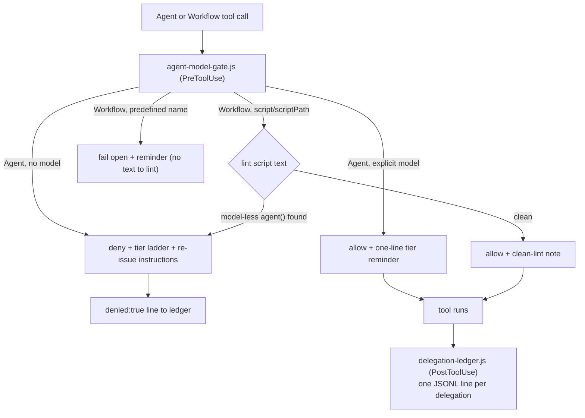

# Hooks

The plugin's deterministic layer: one PreToolUse gate that enforces explicit model choice, one PostToolUse ledger that records every delegation. Both are wired by `hooks.json` with matcher `Agent|Workflow` and `"shell": "bash"` (so the `node` command line resolves identically on Windows via Git Bash and on POSIX systems).

## `agent-model-gate.js`

- **Agent branch:** denies any call whose `tool_input` lacks `model`; the denial carries the tier ladder so the orchestrator can re-issue with an explicit choice. Allow responses inject only a one-line reminder.
- **Workflow branch:** lints the launch-time script text (`tool_input.script`, or the file at `tool_input.scriptPath` when readable) for `agent()` calls without a `model` option, and denies the launch quoting the offending call — the only deterministic contact point for workflow-internal spawns, which no hook event reaches individually. The lint is a string heuristic: `/* model-gate:allow */` anywhere in the script suppresses it (documented false-positive escape), predefined workflow names and unreadable `scriptPath`s fail open.
- **Failure posture:** unparseable stdin fails open (a broken hook must not block all delegation); every deny appends a `{ts, tool, denied: true, detail}` line to the ledger so gate value is countable.
- **`--test`:** embedded self-check for the span-boundary regression (see `evals/contract/` in the repo). Any lint change must keep it passing.
- **Env:** `DELEGATION_LEDGER` overrides the ledger path (used by contract tests); default `~/.claude/delegation-ledger.jsonl`.

## `delegation-ledger.js`

PostToolUse observability. Agent calls log `{ts, tool, model, agentType, description}`; Workflow launches log the model list extracted from the script text. The gate makes models *explicit*; the ledger makes tier choices *reviewable* — its 7-day summary (run by the repo's weekly task) is the evidence base for the deferred rationale-gate hardening.

Contract tests for both hooks live in the repo, not the installed payload: [`evals/contract/`](https://github.com/TheRealBillSiegler/claude-plugins/tree/main/evals/contract).
