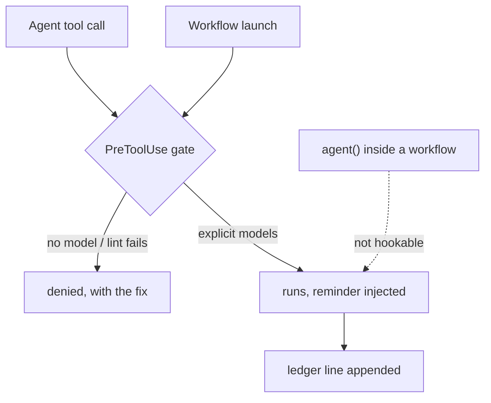

# delegation-tiering

Explicit model/effort tiering for every delegated agent, enforced. Built from an Anthropic article and the official docs, adapted for supervised delegation. Formerly half of `delegation-steering`; its sibling, the [steering-claude-code](https://github.com/TheRealBillSiegler/claude-plugins/tree/main/plugins/steering-claude-code) decision guide, is now its own single-skill plugin.

## Components

| Component | What it does | Fires when |
| --- | --- | --- |
| `skills/delegation-tiering/` | Tier ladder and selection questions for delegated agents (Agent tool, Workflow `agent()` calls, multi-agent plans). | Claude spawns or configures an agent |
| `hooks/agent-model-gate.js` | Denies Agent calls without `model`; lints Workflow script text at launch and denies model-less `agent()` calls. | Every Agent/Workflow call (PreToolUse, matcher `Agent\|Workflow`) |
| `hooks/delegation-ledger.js` | Appends one JSONL line per delegation so tier choices are reviewable, not just explicit. | Every delegation (PostToolUse) |
| `commands/canary.md` | Live end-to-end verification of both gate paths, plus rule-file install. | You run `/delegation-tiering:canary` |

Details:

- **delegation-tiering skill** loads on invocation — the judgment layer, not the always-loaded floor (see Three-layer enforcement below).
- **agent-model-gate** `--test` embeds the regression case for the lint's known failure class: an `agent (` call written with a space must not throw off call-span detection and hide a neighboring model-less call.
- **delegation-ledger** each line records model, agent type, description. A workflow call records `modelLiterals` — named for what it holds: the model strings scanned out of the script text. One entry per literal, not per agent, so a `model:` reused across a fan-out appears once and a non-agent occurrence still counts.

## Verify — required, not optional

In a live session with the plugin enabled:

```text
/delegation-tiering:canary
```

It installs the always-loaded rule file and proves both deny paths live. Run it because the gate's worst failure is silent: if `node` does not resolve when the hook runs, the hook produces no output, and a hook with no output is an allow — no denial, no ledger line, no error. The plugin looks installed and enforces nothing. The canary is the detector; the dated claim lives in the repo's [coverage matrix](https://github.com/TheRealBillSiegler/claude-plugins/blob/main/docs/COVERAGE.md) (dependency A9).

## Configuration

- **Ledger location** — `${CLAUDE_PLUGIN_DATA}/delegation-ledger.jsonl`, the [per-plugin data directory](https://code.claude.com/docs/en/plugins-reference) Claude Code provisions and exports to hook processes. Set `DELEGATION_LEDGER` to redirect it elsewhere.
- **Off switch:** `/plugin disable delegation-tiering` deactivates the components ([plugins reference](https://code.claude.com/docs/en/plugins-reference)). Uninstalling removes the ledger along with the plugin's data directory — pass `--keep-data` to keep it. The rule file `~/.claude/rules/delegation.md` is left alone: it lives with your personal rules, not with the plugin.

## Three-layer enforcement

1. **Always-loaded rule** (`~/.claude/rules/delegation.md`, installed by the canary command): the standing rule survives compaction and holds without skill invocation — a probabilistic floor: it depends on the model following it, unlike the deterministic hook below.
2. **Skill** (on invocation): the judgment layer — which tier is lowest-sufficient.
3. **Hook** (every Agent/Workflow call): the deterministic gate. It has documented limits and one escape hatch — the delegation-tiering skill's Enforcement section states them operationally, and the repo's [coverage matrix](https://github.com/TheRealBillSiegler/claude-plugins/blob/main/docs/COVERAGE.md) is the canonical, dated claim set for every path and gap.

The ledger sits alongside as the observability layer: the gate can force models to be *explicit*, but only review of actual choices can show whether tiering judgment held. Its weekly summary (run from the plugin repo) is the evidence base for a deferred hardening — denying top-tier Agent calls that state no rationale — described in the repo's [docs/ROADMAP.md](https://github.com/TheRealBillSiegler/claude-plugins/blob/main/docs/ROADMAP.md).

### Coverage map



In text: Agent calls and Workflow launches hit the PreToolUse gate, which denies them when no model is named or the lint fails, and otherwise lets them run with a tiering reminder and a ledger line; agent() spawns inside an already-running workflow reach neither the gate nor the ledger.

## Sunset criterion

This plugin is a stopgap for a missing platform feature, not a product to defend. If Claude Code ships native per-delegation model routing (demand is tracked upstream in anthropics/claude-code#27665, #44976, #67898), verify parity against the repo's [docs/COVERAGE.md](https://github.com/TheRealBillSiegler/claude-plugins/blob/main/docs/COVERAGE.md) — every delegation path, deterministically enforced — and archive this plugin. The repo's drift pipeline exists to notice that day, not to outlive it.

## Source fidelity

Every claim in this plugin carries one of three provenance tiers — article digest, doc page, or dated live test — defined in the repo's [Anchoring policy](https://github.com/TheRealBillSiegler/claude-plugins/blob/main/docs/REMEDIATION.md#anchoring-policy). The repo's [coverage matrix](https://github.com/TheRealBillSiegler/claude-plugins/blob/main/docs/COVERAGE.md) names the doc page behind each mechanic; where the docs are silent, the claim says so. Everything used to *build, verify, and maintain* the plugin — evals, dated article digests, verification dates, drift watching — is in the [plugin repo](https://github.com/TheRealBillSiegler/claude-plugins) ([docs map](https://github.com/TheRealBillSiegler/claude-plugins/blob/main/docs/README.md)), not in the installed payload: the payload carries what Claude needs to apply the skill, not the apparatus that built it.

## Design rationale

Why bottom-up, when the source article's default is top-down: the article recommends "start with the most intelligent generally available model and use effort level to dial in performance and cost." This plugin deliberately takes the article's alternative path because it operates strictly downstream of that choice — the orchestrator doing the delegating already **is** the most capable model available in the session, and it stays in the loop, writing the spec, choosing the tier, and reviewing the output. Supervision flips the risk asymmetry: under-provisioning is caught at review and upgraded on evidence, while over-provisioning multiplies across every fan-out. That structure is the article's own advisor strategy generalized across the ladder; with no orchestrator in the loop, the premise is gone, and the skill says to follow the article's top-down default.

The skill's selection questions 1–3 adapt three of the article's four (task difficulty, latency, unit economics); the access-constraints question is deliberately dropped — every model available to the session is equally accessible to a delegated agent, so availability is already folded into the top-tier definition. Question 4 (did design already happen?) is a delegation-specific addition with no article counterpart.
