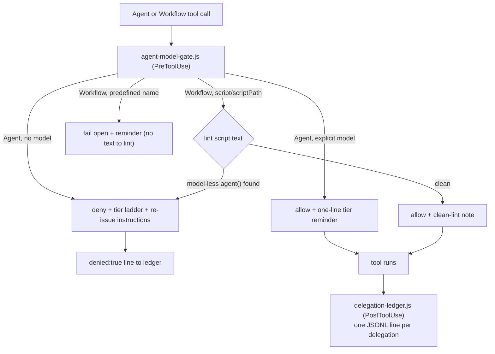

# Hooks

The plugin's deterministic layer: one PreToolUse gate that enforces explicit model choice, one PostToolUse ledger that records every delegation. Both are wired by `hooks.json` with matcher `Agent|Workflow`, in [exec form](https://code.claude.com/docs/en/hooks) — `command` is `node` and the script path is an `args` element, so Claude Code spawns the binary directly with no shell between it and the script. That is what the docs recommend whenever a hook references a path placeholder, and it means no Git Bash is needed on Windows.

The ledger additionally sets `"async": true`. Nothing reads its output and no decision waits on it, so it runs in the background and adds no blocking time to a delegation. The gate cannot: it returns the allow/deny decision.

In text: a call reaches the gate, which denies an Agent call missing a model, allows one with an explicit model, lints Workflow script text and denies or allows depending on whether every agent() call names a model, fails open with a reminder when there is no script text to lint, and logs every denial or completed run to the ledger — the same branches the list below spells out.

## `agent-model-gate.js`

- **Agent branch:** denies any call whose `tool_input` lacks `model`; the denial carries the tier ladder so the orchestrator can re-issue with an explicit choice. Allow responses inject only a one-line reminder.
- **Workflow branch:** lints the launch-time script text (`tool_input.script`, or the file at `tool_input.scriptPath` when readable) for `agent()` calls without a `model` option, and denies the launch quoting the offending call — the only deterministic contact point for workflow-internal spawns, which no hook event reaches individually. The lint is a string heuristic: `/* model-gate:allow */` suppresses only the call whose span it sits in — the span runs from that `agent(` to the next one, so a marker in a file header suppresses nothing. Predefined workflow names fail open with a reminder; an unreadable `scriptPath` fails open silently.
- **Failure posture:** unparseable stdin fails open (a broken hook must not block all delegation); every deny appends a `{ts, tool, denied: true, detail}` line to the ledger so gate value is countable.
- **`--test`:** embedded self-check for the span-boundary regression — run `node agent-model-gate.js --test` to verify the lint on your install. The fuller contract suite lives in the plugin repo: [evals/delegation-tiering/contract/](https://github.com/TheRealBillSiegler/claude-plugins/tree/main/evals/delegation-tiering/contract).
- **Ledger path:** resolved in `ledger.js`, shared with the ledger hook — `DELEGATION_LEDGER` (contract tests use this), else `${CLAUDE_PLUGIN_DATA}/delegation-ledger.jsonl`, else `~/.claude/delegation-ledger.jsonl` for runs outside a plugin context.

## `delegation-ledger.js`

PostToolUse observability, running async. Agent calls log `{ts, tool, cwd, model, agentType, description}`; Workflow launches log `modelLiterals`, the model strings scanned out of the script text — one entry per literal, not per agent spawned. The gate makes models *explicit*; the ledger makes tier choices *reviewable* — inspect it to see whether tiering judgment held, not just whether models were named.

Contract tests for both hooks live in the repo, not the installed payload: [`evals/delegation-tiering/contract/`](https://github.com/TheRealBillSiegler/claude-plugins/tree/main/evals/delegation-tiering/contract).
