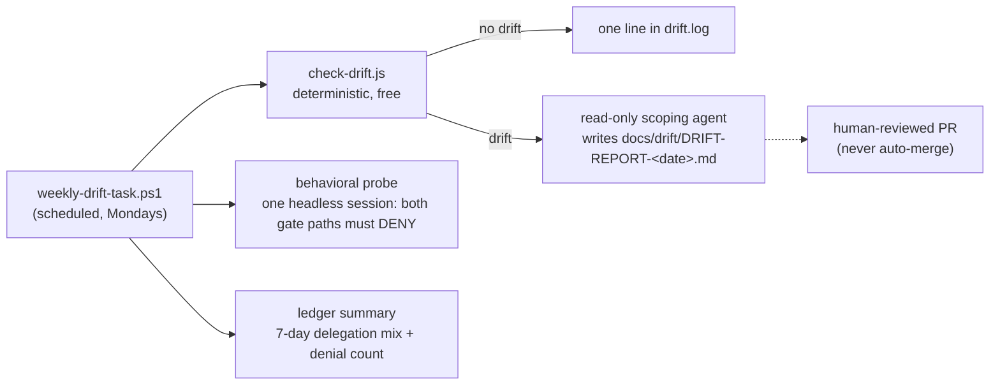

# Scripts (repo apparatus — not shipped with the plugin)

The freshness machinery: deterministic drift detection against dated anchors, and the weekly wrapper that runs it plus a live behavioral probe and a ledger summary.

In text: weekly-drift-task.ps1 runs check-drift.js, which logs one line when clean or hands drift to a read-only scoping agent that writes a dated DRIFT-REPORT bound for a human-reviewed PR, plus a behavioral probe that both gate paths must deny and a ledger summary of the 7-day delegation mix — the same three checks the file list below details.

## Files

- **`check-drift.js`** — hashes the `code.claude.com/docs` pages the shipped skills and `docs/COVERAGE.md` cite, deriving that set from the citations themselves so a newly anchored claim is watched without a second edit here, and compares `claude --version` against `anchors.json`. Exit 0 = no drift, 1 = drift (lists what changed), 2 = error. `--update` rebaselines the anchors; commit the refreshed file only after the drift has been scoped (see [../docs/REMEDIATION.md](../docs/REMEDIATION.md)).
- **`anchors.json`** — the dated baseline: capture timestamp, Claude Code version, and one SHA-256 per watched page. Hash-only by design (cheap, no stored page copies); the tradeoff is that scoping a drift requires re-fetching pages, documented as a known limitation in [the 2026-08-06 drift report](../docs/drift/DRIFT-REPORT-2026-08-06.md).
- **`live-probe.js`** — one metered headless session that proves the delegation-tiering hooks live: both deny paths land `denied:true` lines in a temp-redirected ledger, one allowed call proves the async PostToolUse write, and every assertion reads the ledger rather than the model's self-report. `--dev` loads the working-tree plugin via `--plugin-dir`. This is the on-demand form of the weekly probe, with ledger-grounded assertions instead of transcript matching.
- **`weekly-drift-task.ps1`** — Windows Task Scheduler wrapper (PowerShell 5.1-compatible on purpose; registration snippet in the header comment). Three checks in cost order: drift detection (free), behavioral probe (one small metered session asserting `GATE-AGENT: DENIED` and `GATE-WORKFLOW: DENIED`), ledger summary (free). Appends everything to `drift.log` — machine-local, gitignored. Only the wrapper is Windows-specific; the checks it runs (`check-drift.js`, the probe prompt, the summary logic) are portable — port the wrapper, not the checks.

## Known blindness

Drift detection is preservation-only — see [the blindness note and its compensating control](../docs/REMEDIATION.md#known-blindness-drift-detection-is-preservation-only) in the remediation procedure.
