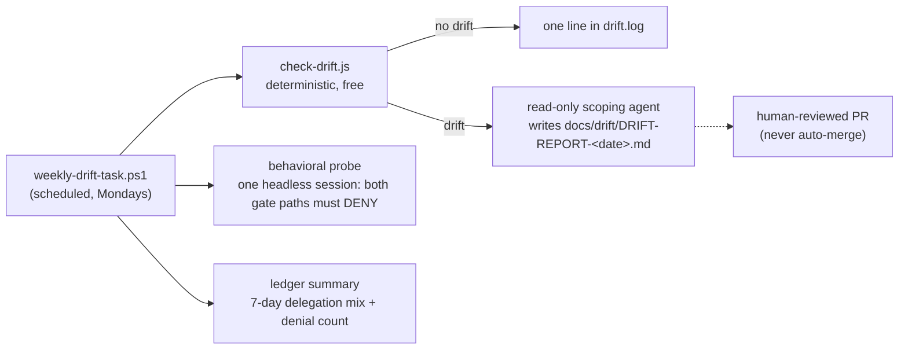

# Scripts (repo apparatus — not shipped with the plugin)

The freshness machinery: deterministic drift detection against dated anchors, and the weekly wrapper that runs it plus a live behavioral probe and a ledger summary.

## Files

- **`check-drift.js`** — hashes six anchored `code.claude.com/docs` pages and compares `claude --version` against `anchors.json`. Exit 0 = no drift, 1 = drift (lists what changed), 2 = error. `--update` rebaselines the anchors; commit the refreshed file only after the drift has been scoped (see [../docs/REMEDIATION.md](../docs/REMEDIATION.md)).
- **`anchors.json`** — the dated baseline: capture timestamp, Claude Code version, and one SHA-256 per watched page. Hash-only by design (cheap, no stored page copies); the tradeoff is that scoping a drift requires re-fetching pages, documented as a known limitation in the run register.
- **`weekly-drift-task.ps1`** — Windows Task Scheduler wrapper (PowerShell 5.1-compatible on purpose; registration snippet in the header comment). Three checks in cost order: drift detection (free), behavioral probe (one small metered session asserting `GATE-AGENT: DENIED` and `GATE-WORKFLOW: DENIED`), ledger summary (free). Appends everything to `drift.log` — machine-local, gitignored.

## Known blindness

Drift detection is preservation-only: it answers "did what we rely on change?", never "did something new appear we should use?" The monthly changelog review in [../docs/REMEDIATION.md](../docs/REMEDIATION.md) is the compensating control.
